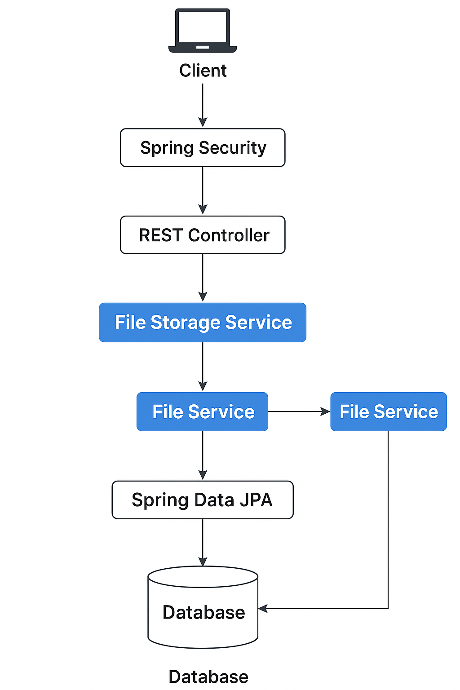

# 📁 File Upload Service (Spring Boot + JWT + Versioning + RBAC)

A secure and scalable file upload system built using **Spring Boot**, with features like:
- File upload/download with versioning
- Role-based access control (Admin/User)
- JWT-based authentication
- File metadata storage in a relational database
- Swagger UI for API exploration

---

## 📦 Features

✅ Upload files with automatic versioning  
✅ Download, delete, and view file metadata  
✅ JWT Authentication  
✅ Role-based access (Admin/User)  
✅ Swagger UI for API testing  
✅ Modular architecture  
✅ Custom exception handling

---

## 🧠 Tech Stack

| Layer            | Technology                        |
|------------------|------------------------------------|
| Language         | Java 17                            |
| Framework        | Spring Boot 3                      |
| Security         | Spring Security, JWT               |
| Persistence      | Spring Data JPA, H2 (or MySQL)     |
| API Docs         | Swagger (Springdoc OpenAPI)        |
| Build Tool       | Maven                              |
| Deployment       | Render or Any Cloud                |

---

## 🚀 Getting Started

### 1. Clone the Repo

```bash
git clone https://github.com/KapilXDev/file-upload-service.git
cd file-upload-service
```

### 2. Build and Run

```bash
./mvnw spring-boot:run
```

Runs the app locally on:  
📍 `http://localhost:8080`

### 3. Access Swagger UI

```
http://localhost:8080/swagger-ui/index.html
```

---

## 🔐 Authentication

### Sample JWT Tokens:

You can hardcode tokens for testing or implement login APIs.

#### Add JWT token in Swagger:
Click **Authorize** button → paste your token:
```
Bearer <your_jwt_token_here>
```

---

## 🧪 API Endpoints

| Method | Endpoint                   | Description                 | Role      |
|--------|----------------------------|-----------------------------|-----------|
| POST   | `/api/files/upload`        | Upload file                 | USER/ADMIN |
| GET    | `/api/files/download/{id}` | Download by ID              | USER/ADMIN |
| GET    | `/api/files/metadata`      | View all file metadata      | USER/ADMIN |
| DELETE | `/api/files/delete/{id}`   | Delete file by ID           | ADMIN only |

---

## 🗃️ Project Structure

```
file-upload-service/
├── controller/              # REST Controllers
├── model/                   # Entity + DTOs
├── service/                 # Business Logic
├── repository/              # JPA Repositories
├── config/                  # JWT + Security config
├── util/                    # Utility classes
├── exception/               # Custom Exceptions
└── FileUploadServiceApp.java
```

---

## 🧱 Architecture Diagram



---

## 🔐 Roles

| Role  | Permissions                      |
|-------|----------------------------------|
| ADMIN | Full access (Upload, Delete, View) |
| USER  | Upload + View only              |

---

## 🧑‍💻 Author

**Kapil Dev**  
Backend Developer | Java + Spring Boot + DSA  
📫 [kapil.backenddev@gmail.com](mailto:kapil.backenddev@gmail.com)  
🌐 [LinkedIn](https://www.linkedin.com/in/kapil-dev-6982ba144) | [GitHub](https://github.com/KapilXDev)

---

## 📄 License

This project is open-source and available under the [MIT License](LICENSE).

---
